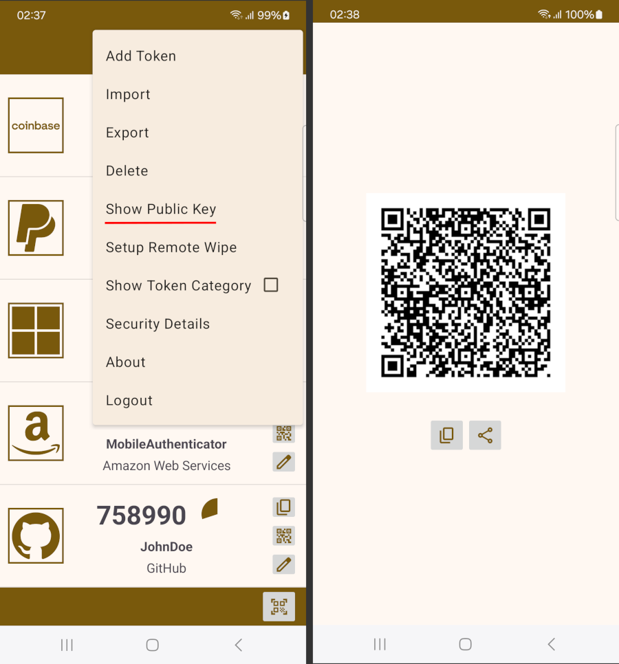
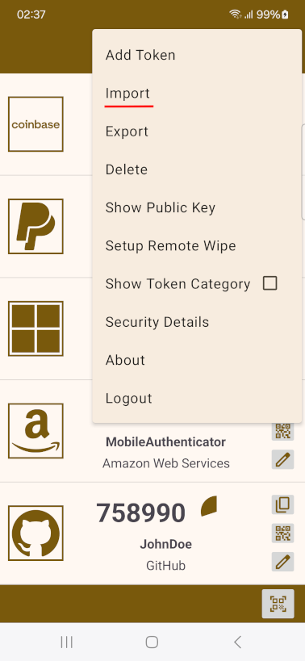

Totpy
=========================
Mobile authenticator for generating one-time passwords based on [TOTP Protocol](https://www.rfc-editor.org/rfc/pdfrfc/rfc6238.txt.pdf).  
Compatible desktop version of this app is also available: [totpy-desktop-authenticator](https://github.com/FilipBlazekovic/totpy-desktop-authenticator).  

Supports:

- protection of tokens using screen lock credentials (mandatory)
- remotely deleting tokens by sending an SMS message containing a predefined phrase (additional protection in case a device gets stolen)
- sorting tokens based on category (work, personal, email, ...)
- search based on token category, issuer or account
- adding tokens by scanning a QR code, entering OTPAuth URI, or manually entering values for required token parameters
- exporting tokens to a file protected by a password or second authenticator's asymmetric key
- importing tokens from a locked export file

---

**USING CATEGORIES TO SORT TOKENS**

---

**TRANSFERRING A SINGLE TOKEN TO A SECOND AUTHENTICATOR APP**

A QR code containing an OTPAuth URI for a token compatible with any 2FA app is presented by clicking on a QR code button on the side of a token panel.

---

**EXPORTING TOKENS**

Tokens can be exported to a file for backup or transfer to a second authenticator app.  
The generated export file containing encrypted tokens will be compatible with mobile and desktop versions of this app.

**To generate a password-protected export:**

1. select "Export" option in the top menu
2. select tokens you wish to export and click on the export button on the bottom of the UI
3. select "Protect with password" option in the popup dialog that appears and define a password

**To generate an asymmetric-key protected export:**

1. select "Export" option in the top menu
2. select tokens you wish to export and click on the export button on the bottom of the UI
3. select "Protect with public key" option in the popup dialog that appears by pressing a button to scan the public key from a QR code, or a button to load a public key from a file

To view or save the public key of a second authenticator to which you wish to transfer tokens to, select "Show Public Key" dialog in the top menu of that authenticator app.

File **export_locked.json** containing tokens encrypted with AES/GCM will be generated.

---

**IMPORTING TOKENS**

Select "Import" option in the top menu and select the locked export file from which you with to import tokens.
In case tokens are locked using this device's asymmetric key they are automatically decrypted and imported, otherwise password input dialog is shown.

---

**SETTING-UP REMOTE WIPE**

